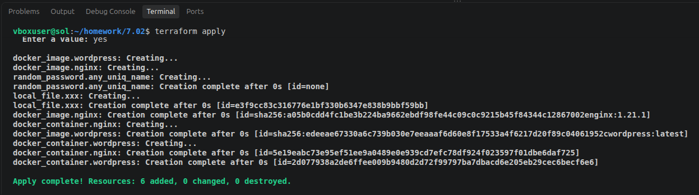
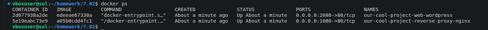

# Задание

    Установите Terraform на компьютерную систему (виртуальную или хостовую), используя лекцию или инструкцию. download: https://hashicorp-releases.yandexcloud.net/terraform/

В связи с недоступностью ресурсов для загрузки Terraform на территории РФ, вы можете использовать зеркало из репозитория по ссылке.

    Повторите демо из лекции! документация провайдеров: https://library.tf/providers

# Решение

- [main.tf](main.tf)
- [providers.tf](providers.tf)
- [variables.tf](varibles.tf)

- result: 
- docker ps: 