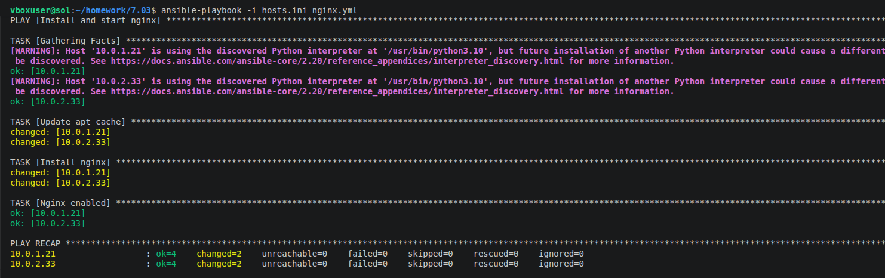
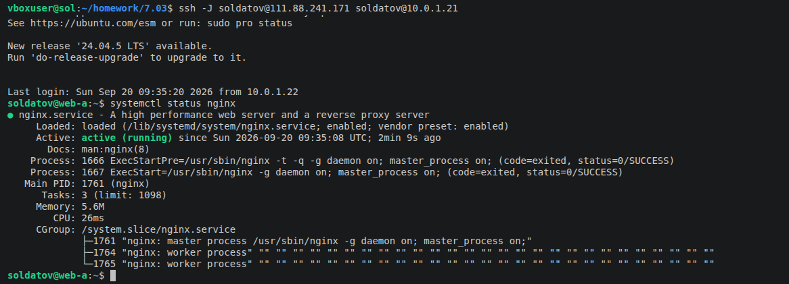
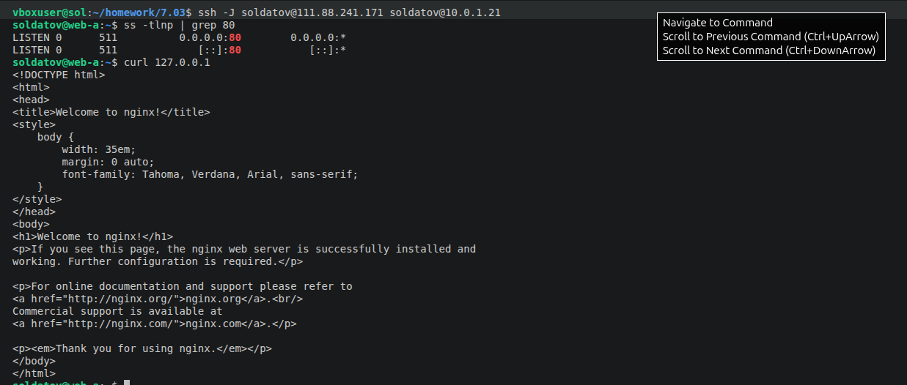
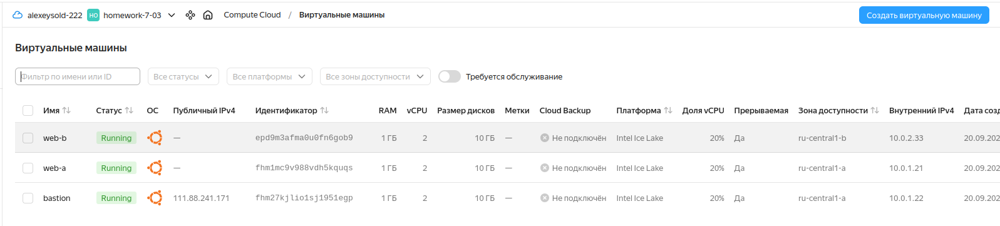

# Подъем инфраструктуры в облаке. Солдатов А.О.

## Задание 1

    Повторить демонстрацию лекции (развернуть vpc, 2 веб сервера, бастион сервер).

## Задание 2

    С помощью ansible подключиться к web-a и web-b , установить на них nginx.(написать нужный ansible playbook)
    Провести тестирование и приложить скриншоты развернутых в облаке ВМ, успешно отработавшего ansible playbook.

## Решение 1-2

  Конфигурационные файлы terraform:
  - [network.tf](network.tf)  
  - [main.tf](main.tf)
  - [variables.tf](variables.tf)
  - [providers.tf](providers.tf)

  Ansible playbooks:
  - [test.yml](test.yml) Лекция
  - [nginx.yml](nginx.yml) Задание 2 "install nginx"
  - Результаты отработавшего плейбука, тестирование статуса и 80 порта, машины в облаке:
    
    
    
    
    

    
